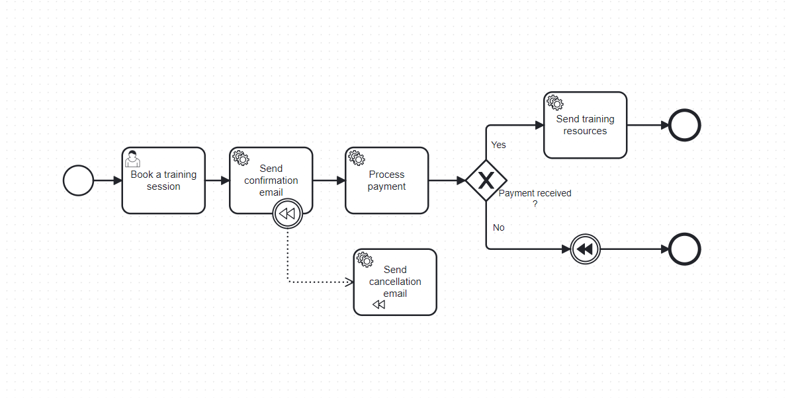
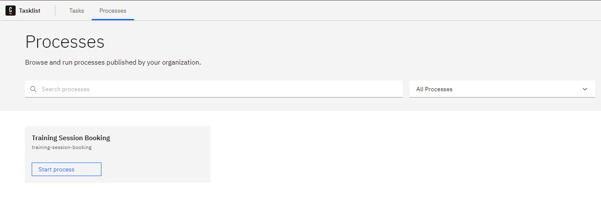

# Camunda 8 Compensation Event Demo Project
This is a demo project for the BPMN element compensation event implemented in Camunda 8.

## BPMN process for this project

## Steps to start the project
### 1. Start Camunda 8 locally with Docker
Make sure you have Docker installed locally on your computer, and then run the following commands:

`cd path-to-project/docker`

`docker-compose up`

### 2. Start the backend application

### 3. Go to the Camunda Tasklist and start a new process instance

